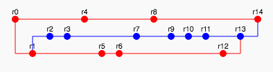

# softwareEngineeringBasics

### 1st 
Assigment:
Вариант №1723425: "Пикабу" - информационное сообщество рунета. Информационно-развлекательное сообщество, которым управляют пользователи - http://pikabu.ru/ | 
:---: |
> Составить список требований, предъявляемых к разрабатываемому веб-сайту. Требования должны делиться на следующие категории:

    Функциональные.
        Требования пользователей сайта.
        Требования владельцев сайта.
    Нефункциональные.

Требования необходимо оформить в соответствии с шаблонами RUP (документ SRS - Software Requirements Specification). Для каждого из требований нужно указать его атрибуты (в соответствии с методологией RUP), а также оценить и аргументировать приблизительное количество часов, требующихся на реализацию этого требования.

Для функциональных требований нужно составить UML UseCase-диаграммы, описывающие реализующие их прецеденты использования.  

### 2nd 
Assignment:  

> Воспроизвести последовательность команд для систем контроля версий svn и git, осуществляющих операции над исходным кодом, приведённые на блок-схеме.

При составлении последовательности команд необходимо учитывать следующие условия:

    1. Цвет элементов схемы указывает на пользователя, совершившего действие (красный - первый, синий - второй).
    2. Цифры над узлами - номер ревизии. Ревизии создаются последовательно.
    3. Необходимо разрешать конфликты между версиями, если они возникают.
